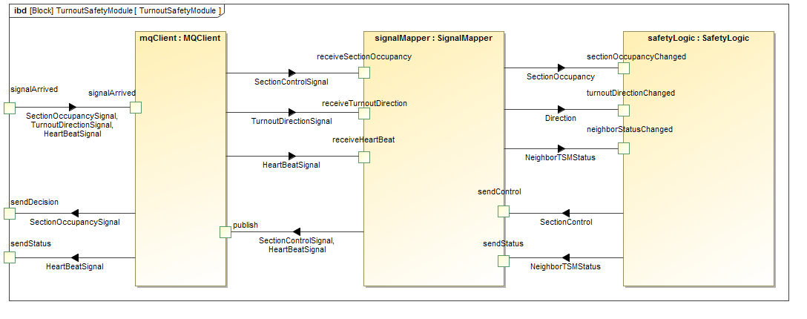

**Instructors' repository for the home assignments of the SWSV 2016 course. This repository will be updated for future phases of the assignment.**

# Turnout Safety Module (TSM)

The repository contains the specification and implementation of the Turnout Safety Module (TSM) component of the Railway Interlocking System (RIS).

## Overview

### Organization of the repository

```
ris-2016
|-- doc: requirements specification of TSM
`-- src
    |-- swsv-ris
        |-- src
            |-- main: preliminary implementation
            `-- test: unit tests
```

### Internal structure of TSM



The TSM consists of the following three main parts.

- `MQClient`: Responsible for sending and receiving messages from the communication channels.
- `SignalMapper`: Responsible for translating ids to sides and sides to ids when receiving and sending signals.
- `SafetyLogic`: Responsible for keeping track of the status of its associated sections, turnouts and neighbors, controls its sections and informs its neighbors about its status.

The implementation is currently work in progress. MQClient and SignalMapper are not yet implemented, and the distributed decision and heartbeat functionality is missing from SafetyLogic.

## Development guide

The project uses
- [Maven](https://maven.apache.org/) for building,
- [SonarQube](http://www.sonarqube.org/) for static analysis,
- [JaCoCo](http://www.eclemma.org/jacoco/) for measuring code coverage.

### Building the project

Use the following command to execute some of the build tasks. Maven will place all its output into the `target` folder.

```
mvn <phase>
```

Important Maven build phases (each phase will execute the other before them in the default lifecycle):

- `compile`: compile the source code of the project
- `test`: compile and run unit tests
- `package`: create a distributable format (JAR) and generate coverage reports

To clean the project execute the clean phase.

- `clean`: remove all files generated by the previous build

To generate coverage reports with JaCoCo execute the following goal:

- `jacoco:report`: generate test coverage report.

To run SonarQube execute the following goal:

- `sonar:sonar`: run SonarQube analysis (if you want test and code coverage results in Sonar then this goal should be called after the test phase)

In order to execute the integration tests, run the `verify` or `integration-test` goals. The project uses a Maven plugin called `build-helper-maven-plugin` to add integration test files and resources to the build. This plugin requires an extension for Eclipse (`m2e connector for build-helper-maven-plugin`), which can be installed using the fixing suggestion provided by the IDE. For more details take a look at [here](http://stackoverflow.com/questions/37159619/installing-m2e-connectors-manually) and [here](http://stackoverflow.com/questions/36824645/how-to-preinstall-eclipse-m2e-configurators-plugin-execution-not-covered-by-lif).

## Common issues

1. *Tip for Eclipse users:* If the `pom.xml` has errors on lines containing `<execution>` tags, press Ctrl+1 and click "Search for connectors" (or "Discover new m2e connectors" in Eclipse Neon). This will install "m2e connector for build-helper-maven-plugin".

1. *Problem:* The Maven compilation fails in Eclipse:

  ```
  [ERROR] Failed to execute goal org.apache.maven.plugins:maven-compiler-plugin:3.1:compile (default-compile) on project swsv-ris: Compilation failure
  [ERROR] No compiler is provided in this environment. Perhaps you are running on a JRE rather than a JDK?
  ```

  *Solution:* Modify the Eclipse settings so that it uses your JDK installation instead of JRE. See more [here](http://stackoverflow.com/questions/19655184/no-compiler-is-provided-in-this-environment-perhaps-you-are-running-on-a-jre-ra).
